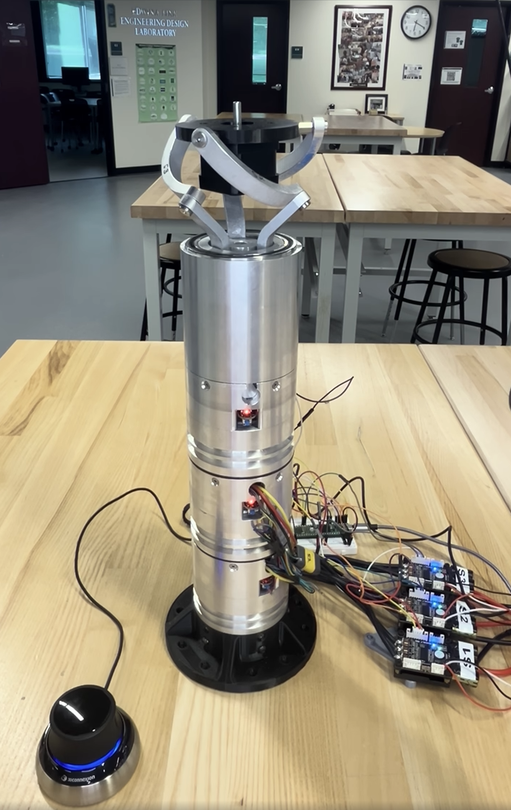
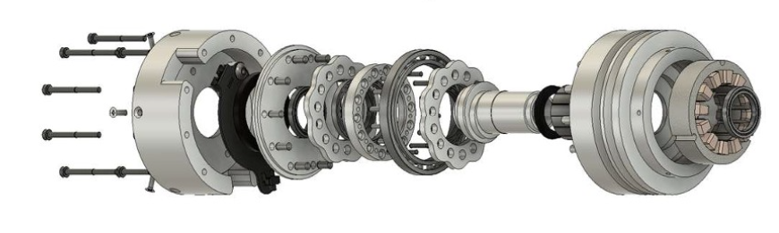
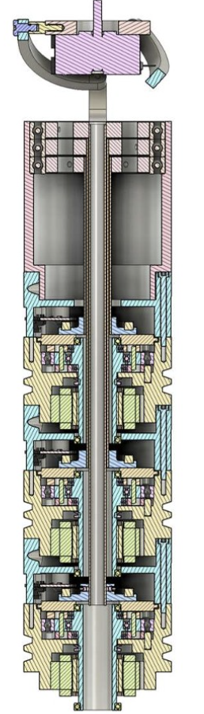

# Spherical Parallel Manipulator

<p align="center">
  
</p>

Roan Torpey and I built this **3-degree-of-freedom Spherical Parallel Manipulator (SPM)** to expand our experience in robotics, embedded control systems, and mechanical design.

The mechanism functions as a compact robotic wrist, allowing the top platform to rotate in **roll, pitch, and yaw** about a fixed center point. SPMs are commonly used in applications such as surgical robotic wrists, camera gimbals, and other high-precision orientation systems.

## Design

<p align="center">
  
</p>

The system uses three stacked geared BLDC actuator modules to control the parallel linkage above them. Absolute encoders provide joint feedback, while a hollow center allows wiring to pass through the assembly.

<p align="center">
  
</p>

## Control System

The current prototype uses:

- Teensy 4.1 embedded controller
- Three VESC motor controllers
- Three Lamprey2 absolute encoders
- Geared BLDC motors
- 3Dconnexion SpaceMouse
- Python-based inverse kinematics

Live SpaceMouse input is converted into a desired roll, pitch, and yaw orientation. The inverse-kinematics solver calculates the required joint angles, which are sent to the Teensy for closed-loop motor control.

```text
SpaceMouse → Inverse Kinematics → Teensy 4.1 → VESCs → SPM
```

## Demo

The video below shows the SPM tracking live SpaceMouse input using inverse kinematics.

***[Watch the demo](https://www.linkedin.com/feed/update/urn:li:activity:7463012857752924160/)***

## Current Status

The system is still an active prototype. Future work includes improved calibration, trajectory planning, dynamic control, custom motor-controller hardware, and more compact electronics integration.

Feedback from anyone with experience in robotics, controls, embedded systems, or mechanical design is welcome.
